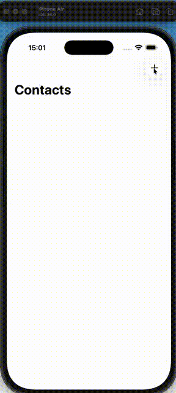
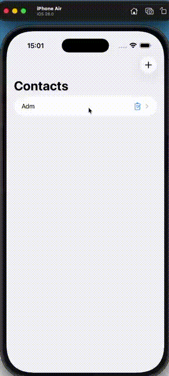
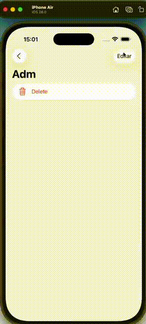
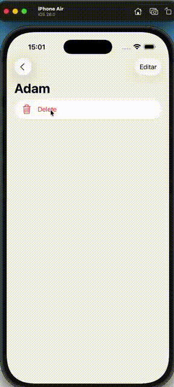
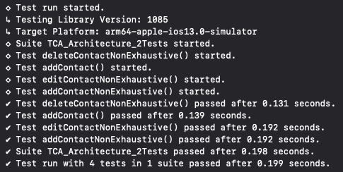

# TCA Navigation Study — CRUD Contacts Application

### iOS 26 , Swift 5 , SPM swift-composale-architecture 1.25.5

## Project Structure
```swift
ContactsFeature
├── Destination (alerts, sheets)
│   └── AddContactFeature 
└── Navigation (StackState)
   └── ContactDetailFeature
       ├── DeleteContact (action)
       └── Destination
           └── AddContactFeature (reused for editing)
```
---

## Objective

This repository serves as:

- A reference implementation of Composable Architecture (TCA) navigation patterns
- A study case for feature composition and reuse
- A practical guide for testing navigation-driven flows

---

<html> 
<table>
  <tr>
    <td align="center">
      <br>
      Create
    </td>
    <td align="center">
      <br>
      Read
    </td>
    <td align="center">
      <br>
      Update
    </td>
    <td align="center">
      <br>
      Delete
    </td>
  </tr>
</table>
</html>

## Overview

This repository contains a structured implementation based on Chapter 2 — *Navigation* from the official TCA tutorial:

https://swiftpackageindex.com/pointfreeco/swift-composable-architecture/main/tutorials/meetcomposablearchitecture

The purpose of this project is to explore and consolidate best practices for modeling navigation and feature composition using TCA, with additional enhancements to improve reusability, maintainability, and test coverage.

Official TCA Swift Package Manager (SPM):

https://github.com/pointfreeco/swift-composable-architecture

---

## About The Composable Architecture (TCA)

The Composable Architecture is a library for building applications in a consistent and predictable way, emphasizing:

- Centralized and explicit state management
- Clear action-driven data flow
- Isolation and composition of features
- High testability of business logic

Each feature is composed of:

- **State**: Source of truth for UI and logic
- **Action**: All possible user and system events
- **Reducer**: Pure function that handles state transitions
- **Effects**: Side effects and asynchronous operations

---

## Scope of This Implementation

This project focuses on navigation patterns using:

- `NavigationStack`
- `StackState`
- `StackAction`
- Parent-child feature communication via delegation

Key concepts addressed:

- Navigation modeled as state
- Stack-based navigation management
- Decoupled communication between features
- Deterministic state transitions

---

## Enhancements Beyond the Original Tutorial

### 1. Feature Reuse: AddContact as EditContact

The existing `AddContactFeature` was extended to support editing scenarios:

- Eliminates duplication of logic
- Promotes reuse and consistency
- Integrated into `ContactDetailFeature`

---

### 2. Navigation Abstraction via Destination

A `Destination` abstraction layer was introduced to:

- Centralize navigation-related states (alerts, sheets, flows)
- Improve separation of concerns
- Simplify state management for navigation

---

### 3. Test Improvements and Corrections

Adjustments were made to ensure compatibility with modern TCA navigation patterns:

- Correct usage of `TestStore.send` vs `TestStore.receive`
- Handling of internal actions such as:
  - Delegate actions (`.delegate`)
  - Navigation effects (`.path(.popFrom)`)

- Ensured correct reducer execution order to avoid runtime inconsistencies

---

### 4. Additional Test Coverage

A new test was implemented to validate the edit contact flow:

- Navigation to detail view
- Triggering edit mode
- Updating contact data
- Verifying state mutation

---

## Testing Approach

<html>
 
</html>

The testing strategy follows a key principle of TCA:

> Navigation is modeled as state, not as an explicit action.

Implications:

- UI-driven navigation (`NavigationLink(state:)`) is not directly tested
- Tests focus on:
  - State mutations
  - Business logic
  - Delegate propagation

Example:

```swift
initialState.path = StackState([
    ContactDetailFeature.State(...)
])
```

## Key Learnings

### Reducer Execution Order

When working with `StackState`:

- Child reducers must execute before parent reducers
- Incorrect ordering may lead to runtime issues such as:
  - "forEach received an action for a missing element"

---

### Explicit Action Handling

- Use `send` for user-driven actions
- Use `receive` for internally generated actions (effects, delegates)

---

### Navigation Handling

- Navigation is fully derived from state
- Avoid treating navigation as an imperative action
- Prefer declarative state-driven transitions

---

## References

- TCA Repository: https://github.com/pointfreeco/swift-composable-architecture
- Official Tutorial: https://swiftpackageindex.com/pointfreeco/swift-composable-architecture/main/tutorials/meetcomposablearchitecture

---

## Notes

This project reflects adaptations required to align the tutorial with newer versions of Swift and TCA, including navigation APIs and testing patterns.